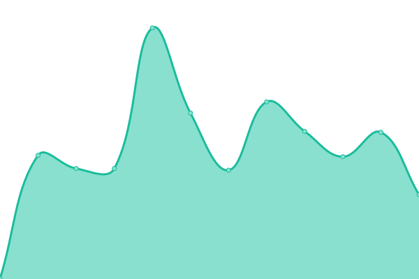
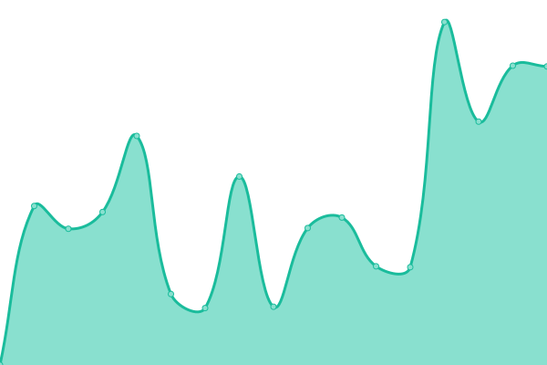

# [📈 Live Status](https://status.elsites.fr): <!--live status--> **🟧 Partial outage**

This repository contains the open-source uptime monitor and status page for [lucas-dev31140](https://status.elsites.fr), powered by [Upptime](https://github.com/upptime/upptime).

With [Upptime](https://upptime.js.org), you can get your own unlimited and free uptime monitor and status page, powered entirely by a GitHub repository. We use [Issues](https://github.com/lucas-dev31140/elsitesstatus/issues) as incident reports, [Actions](https://github.com/lucas-dev31140/elsitesstatus/actions) as uptime monitors, and [Pages](https://status.elsites.fr) for the status page.

<!--start: status pages-->
<!-- This summary is generated by Upptime (https://github.com/upptime/upptime) -->
<!-- Do not edit this manually, your changes will be overwritten -->
<!-- prettier-ignore -->
| URL | Status | History | Response Time | Uptime |
| --- | ------ | ------- | ------------- | ------ |
|  [Site principal](https://elsites.fr) | 🟥 Down | [site-principal.yml](https://github.com/lucas-dev31140/elsitesstatus/commits/HEAD/history/site-principal.yml) | 

 546ms
     
 | 

<a href="https://status.elsites.fr/history/site-principal">69.86%</a>
    

|  [Espace client](https://client.elsites.fr) | 🟩 Up | [espace-client.yml](https://github.com/lucas-dev31140/elsitesstatus/commits/HEAD/history/espace-client.yml) | 

 1317ms
     
 | 

<a href="https://status.elsites.fr/history/espace-client">99.82%</a>
    

|  [Serveur web](https://web.elsites.fr) | 🟥 Down | [serveur-web.yml](https://github.com/lucas-dev31140/elsitesstatus/commits/HEAD/history/serveur-web.yml) | 

 1260ms
     
 | 

<a href="https://status.elsites.fr/history/serveur-web">69.89%</a>
    

<!--end: status pages-->

[**Visit our status website →**](https://status.elsites.fr)

## 📄 License

- Powered by: [Upptime](https://github.com/upptime/upptime)
- Code: [MIT](./LICENSE) © [Anand Chowdhary](https://anandchowdhary.com), supported by [Pabio](https://pabio.com)
- Data in the `./history` directory: [Open Database License](https://opendatacommons.org/licenses/odbl/1-0/)
